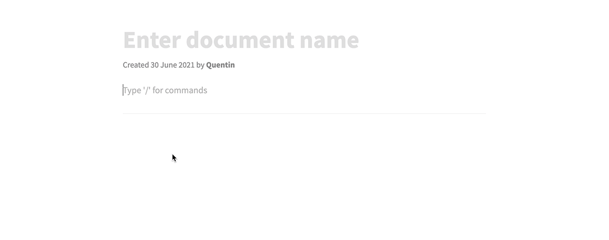

Our text editor now supports markdown shortcuts!

It will help you to take your interview notes way faster and easily change text formatting.

Markdown shortcuts you can use:

- Heading 1: `# Heading1`
- Heading 2: `## Heading2`
- Heading 3: `### Heading3`
- Italic: `*italic*`
- Bold: `**bold**`
