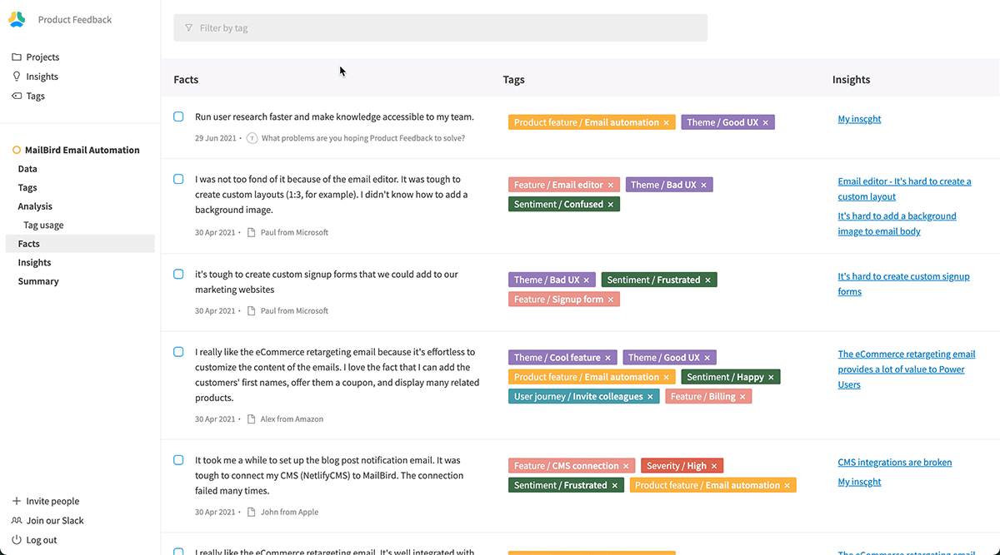

_This was by far the most required feature from our users!_

We've added a new UI in projects that allows you to visualize all the facts that you've created within the project. Those facts can come from any type of customer feedback: interview notes, Typeform surveys, and more.

Thanks to this new interface, you have the ability to **filter your facts** by tag, see the **insights attached to each fact** and **create new insights** by grouping facts together.
