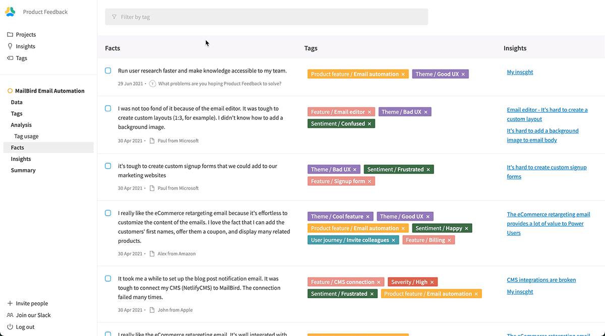

We've added a new UI in projects that allow you to visualize all the facts that you've created within the project. Those facts can come **from any customer feedback**: interview notes, Typeform surveys, and more.

Thanks to this new interface, you can:

- See all the facts
- Filter facts by tag
- See the insights attached to each fact
- Create new insights by grouping facts together.
- Attach facts to existing insights

_It was by far the most requested feature from our users!_

[Sign up for the beta](https://app.productfeedback.com/signup)
